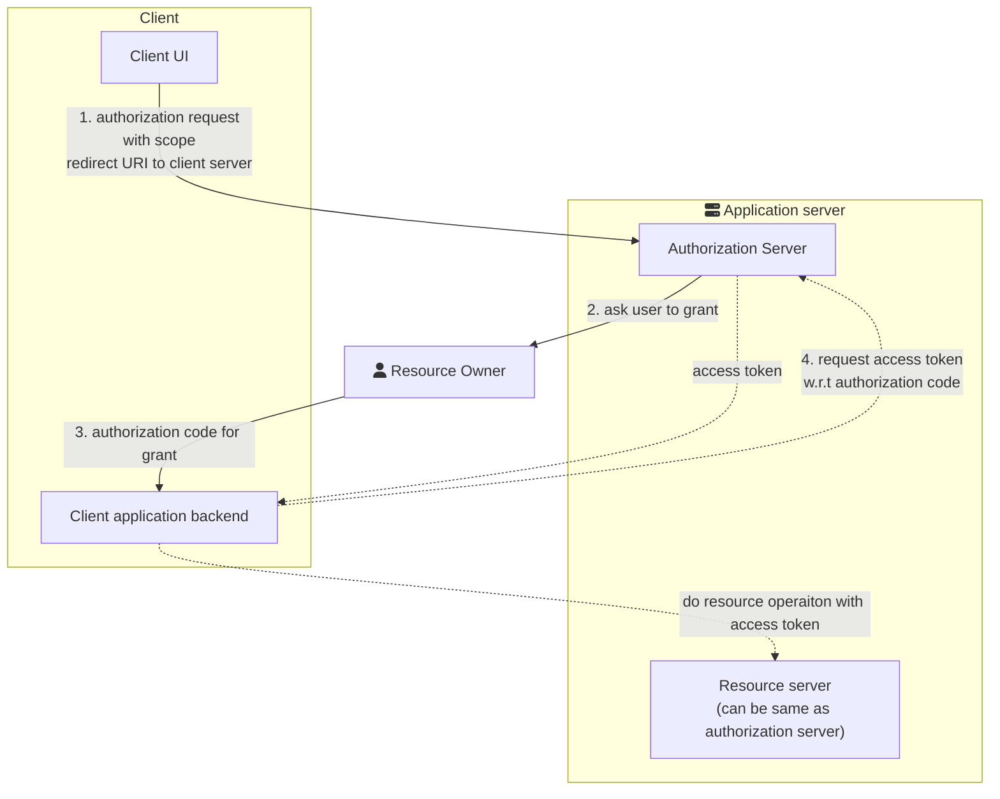
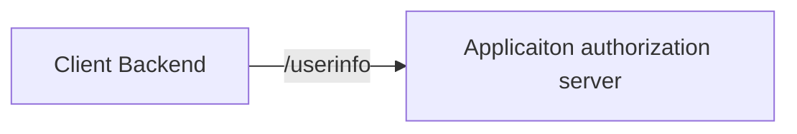

# OAuth 2.0

<!-- toc -->

## Abstract
> The OAuth 2.0 authorization framework enables a third-party
   application to obtain limited access to an HTTP service, either on
   behalf of a resource owner by orchestrating an approval interaction
   between the resource owner and the HTTP service, or by allowing the
   third-party application to obtain access on its own behalf[^1]. 
- Authorize third party client application on behalf of user using external autherization server


## Identity Use case
1. Simple login
2. Single-sign on across multiple sites
3. Mobile app login
4. Delegated authorization 


## Motivation
- In old client-server model, third party tool needs to store and manage the resource owner credentials. 
- Third party application used to get full access.
- Risk of compramising credentials on third party application.
- No way to revoke the access
- OAuth addressess these issues

## OAuth 
- Introduction of authorization layer
- Role based seggregation of third aprty application/client and Resource owner
> Instead of using the resource owner's credentials to access protected
   resources, the client obtains an access token -- a string denoting a
   specific scope, lifetime, and other access attributes.  Access tokens
   are issued to third-party clients by an authorization server with the
   approval of the resource owner.  The client uses the access token to
   access the protected resources hosted by the resource server[^1].

> For example, an end-user (resource owner) can grant a printing
   service (client) access to her protected photos stored at a photo-
   sharing service (resource server), without sharing her username and
   password with the printing service.  Instead, she authenticates
   directly with a server trusted by the photo-sharing service
   (authorization server), which issues the printing service delegation-
   specific credentials (access token).

## High Level Diagram


## Terminology
- Resource Owner
    - User who owns the data
- Client
    - Client or third party application who wants to access user data on bahalf of user
- Authorization Server
    - Main component who stores the authorizaiton details. And generates the access token and all.
- Resource Server
    - Server which holds and serves the data
- Authorization Grant
    - Set of permissions allowed by rsource owner to access the resource
    - Types:
        - authorization code
        - implicit (direct access token for browser based application)
        - resource owner credentials
            - one time use of credentials
            - implicit acess token generation
        - client credentials
            - credentials on behalf of client
            - highrarchical structure
- Redirect URI
    - callback URI of client provided to authorization server
- Scope
    - Atomic unit of Policies or permissions over data
- Access Token
    - key used by client post authorization to access data
    - has the scope information
    - valid for short period
- Refresh token
    - credential used to obtain access token on expiry
    - valid for longer period
    - can be used to request additional scope

    ```mermaid
    sequenceDiagram
        participant client
        participant authServer as "Authorization Server"
        participant resourceServer as "Resource server"
        client ->> authServer:"Authorization grant"
        activate authServer
        authServer ->>client:"Access token & refresh token"
        deactivate authServer
        loop Application lifetime or till refresh token is valid 
            loop "Till access token is valid"
                client ->> resourceServer: Access token
                resourceServer ->> client: Protected resource

                client ->> resourceServer: Access token
                resourceServer ->> client: Invalid token
            end
            client ->> authServer: refresh token
            authServer ->> client: access token & refresh token
        end
    ```

- front channel
    - Unsecure, over the internet
    - Visible query parramentes in browser etc.
    - Over-the-shoulder security breach

- back channel
    - secure, backend server-to-server communication channel
    - shown with dotted lines in above diagram.

## OpenID Connect
- In a sense in authentication protocol extension to OAuth 2.0
- Out of the identity use cases mentioned above, first three comes under __Authentication__ domain and only last one is real use case talking about __authorization__.
- OAuth protocal was mainly desinged considering authorization use case.
- There is no way to get user info in OAuth 2.0, hence its not suitable for completed authentication.

- Adds ID token 



[^1]: https://tools.ietf.org/html/rfc6749 "RFC 6749"